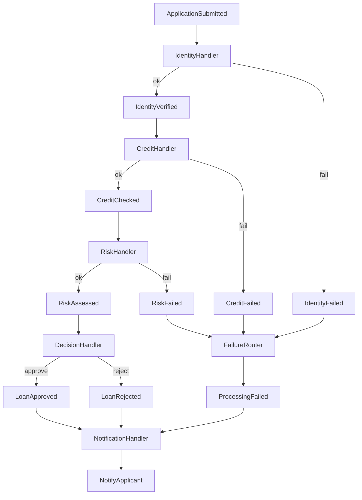

# Event-driven approach (Pub/Sub) — Loan Application

This folder demonstrates an **event-driven** style using **publish/subscribe**:
components (handlers) react to events and may emit new events.

## What this approach looks like

- An `EventBus` provides `subscribe()` and `publish()`.
- Each handler is responsible for a single capability and reacts to a specific event:
  - `IdentityHandler` reacts to `ApplicationSubmitted`
  - `CreditHandler` reacts to `IdentityVerified`
  - `RiskHandler` reacts to `CreditChecked`
  - `DecisionHandler` reacts to `RiskAssessed`
  - `NotificationHandler` reacts to outcome/failure events
- The business process emerges from **event choreography** rather than a central controller.

## How to run

From the repository root:

```bash
python -m event_driven_approach.main
```

You will see 3 scenarios:
- Approved
- Rejected (credit score too low)
- Failure injection (random handler failures)

The demo also prints an **event trace** so you can see which events were published for each application.

## Event flow diagram



## Strengths

- **Loose coupling**: adding a new reaction (e.g., audit logging) can be done by adding a new subscriber without changing existing ones.
- **Extensibility**: new features often become “subscribe to X and publish Y”.
- **Scales by capability**: in real systems, handlers can be separate services consuming from a broker.

## Trade-offs

- **Flow visibility**: the full process is distributed across handlers; you need tracing/logging to see the end-to-end flow.
- **Error handling is distributed**: failures can appear in many places and must be normalized (e.g., a failure router / dead-letter strategy).
- **Event design matters**: naming, payload, and versioning become part of your long-term API.

## Where to look in code

- `event_driven_approach/event_bus.py`: in-memory bus + trace.
- `event_driven_approach/events.py`: event types (the “contract” between handlers).
- `event_driven_approach/handlers.py`: choreography (who reacts to what and what they publish).

