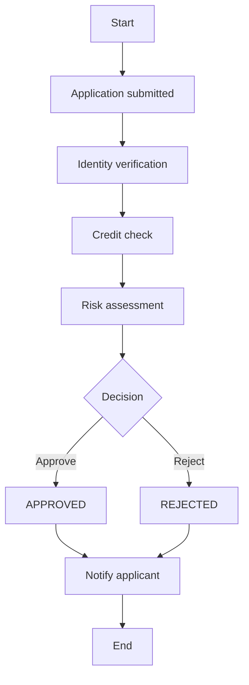
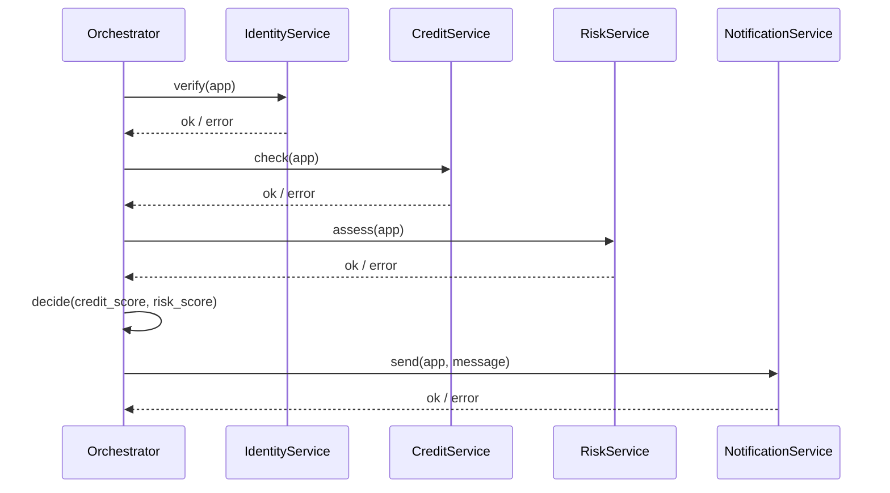

# Workflow approach (Orchestrator) — Loan Application

This folder demonstrates a **workflow/orchestration** style: a central **orchestrator** explicitly controls the business process by calling each step in order.

## What this approach looks like

- A single component (`LoanWorkflowOrchestrator`) knows:
  - the **order of steps**
  - **decision points** (approve/reject)
  - **error handling** strategy (fail fast, best-effort notification)
- Each step is a synchronous call to a service-like class:
  - `IdentityService.verify()`
  - `CreditService.check()`
  - `RiskService.assess()`
  - `NotificationService.send()`

## How to run

From the repository root:

```bash
python -m workflow_approach.main
```

You will see 3 scenarios:

- Approved
- Rejected (credit score too low)
- Failure injection (random service failures)

## Flow diagram



## Sequence diagram (conceptual)



## Strengths

- **Clear control flow**: easy to see the whole process in one place.
- **Simple debugging**: single call chain, straightforward stack traces.
- **Centralized policy**: decisions and thresholds live in one place.

## Trade-offs

- **Tight coupling**: orchestrator must know every step and when to call it.
- **Harder to extend**: adding a new step often requires changing the orchestrator.
- **Scaling by step**: to scale individual steps independently, you typically need to split services and add async messaging later.

## Where to look in code

- `workflow_approach/orchestrator.py`: `LoanWorkflowOrchestrator.process()` is the “single source of truth” for the flow.
- `workflow_approach/services.py`: step implementations + failure injection.